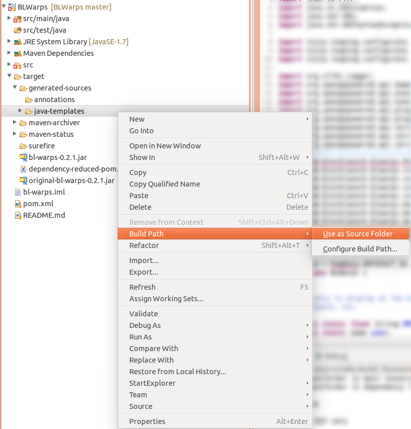

# BLWarps [](https://travis-ci.org/BlockLaunch/BLWarps)
BLWarps is a [Sponge](https://www.spongepowered.org/) plugin for easily setting locations for players to warp to.

## Commands
Note: In the following commands, square brackets (`[]`) indicate optional arguments, and angle brackets (`<>`) indicate required arguments.
### Warp Commands
* `/warp set [-g] <warp name> [x] [y] [z]`
 * Create a new warp with name `warp name` and optional coordinates (`x`, `y`, `z`). Add the `-g` flag to make it a global warp.
* `/warp <warp id>`
 * Warp to the warp with ID `warp id`.
* `/warp delete <warp id>`
 * Delete the warp with ID `warp id`.
* `/warp list`
 * List all of the warps for which one has permission to use
* `/warp info <warp id>`
 * Displays information about the specified warp

### Warp Region Commands
* `/warp region set [-g] <region name> <warp id> <corner1> <corner1>`
 * Create a new warp region with name `region name`, linked warp with ID `warp id` and corners `corner1` and `corner2`
* `/warp region delete <region id>`
 * Delete the warp region with ID `region id`.
* `/warp region list`
 * List all of the regions for which the player has permission to use their linked warps
* `/warp region info <region id>`
 * Displays information about the warp region with ID `region id`

## Warp Regions
A warp region is an area in a world in which a player will be warped to any arbitrary warp if they enter the region. Currently, there is no support for WorldGuard regions, but it is a planned feature. See the `Warp Region Commands` section above for instructions.

## Warp Signs
Warp signs can be created for any previously established warp. To do this, simply place a sign anywhere in the world, and write the following text on each line:

1. [Warp]
2. `<warp name>`
3. Doesn't matter
4. Doesn't matter

If you have correctly placed the sign, the text on the sign will be colored and reformatted. To use the sign to warp, simply right click on the sign.

## Permissions
Permission to use a warp is given on a per-warp basis, as shown below:
 * `blwarps.warp.<warp name>`
Permissions for various commands are as follows:
 * `blwarps.warp.create`: Permission to create a private warp
 * `blwarps.warp.create-global`: Permission to create a global warp
 * `blwarps.warp.delete-global`: Permission to delete a global warp
 * `blwarps.region.create`: Permission to create a private warp region
 * `blwarps.region.create-global`: Permission to create a global warp region
 * `blwarps.region.delete-global`: Permission to delete a global warp region
You can also configure the number of private warps a player can have with the `warpCreationLimit` option. For example, see the following PermissionsEx configuration:
```json
"group": {
    "test": [
        {
            "options": {
                "warpCreationLimit": "2"
            }
        }
    ]
}
```

## Storage
Regardless of the storage solution, each warp has 5 properties:
* id - the unique ID of the warp. Follows the format: `username/warpname`
* name - the name of the warp
* owner - the owner of the warp's UUID, or "global"
* world - the name of the world that contains the warp
* x - the x coordinate of the warp (stored as a double)
* y - the y coordinate of the warp (stored as a double)
* z - the z coordinate of the warp (stored as a double)

### Flat File Storage
For flat file storage, warps are stored as JSON (serialized using [Jackson](http://wiki.fasterxml.com/JacksonHome)) in the `config/BLWarps/warps.json` file. A sample `warps.json` file would be similar to the following:

```json
[ {
    "id" : "global/warp1",
    "name" : "warp1",
    "owner" : "global",
    "world" : "world",
    "x" : 40.3,
    "y" : 41.0,
    "z" : 72.07
}, {
    "id" : "Zirconium/warp2",
    "name" : "warp2",
    "owner" : "5d30e92c-5ae2-4284-a3ee-74bc15077439",
    "world" : "DIM-1",
    "x" : 7.63,
    "y" : 64.0,
    "z" : 11.79
} ]
```
### SQL Storage
Any [JDBC](http://www.oracle.com/technetwork/java/overview-141217.html)-compatible database is a valid option for storing warps. The JDBC connection URL must be specified in the `sql.connection-url`. By default, the Warps will be stored in the `warps` table. Currently, the name of the table cannot be changed. BLWarps uses [JDBI](http://jdbi.org/) for executing queries and mapping results to a [Warp](https://github.com/BlockLaunch/BLWarps/blob/master/src/main/java/com/blocklaunch/blwarps/Warp.java) object.

### [REST API](http://en.wikipedia.org/wiki/Representational_state_transfer) Storage
For REST-based storage, HTTP requests are sent using the  [Jersey Client](https://jersey.java.net/documentation/latest/client.html) to the URI specified by the `rest-uri` field in the configuration. Currently, only basic authentication is available, which uses the `rest.username` and `rest.password` credentials (by default, they are `root` and `pass`, respectively). The plugin will send the following requests, and will expect the `application/json` media type as part of the response:
* `GET` when loading warps - must receive a List of [Warps](https://github.com/BlockLaunch/BLWarps/blob/master/src/main/java/com/blocklaunch/blwarps/Warp.java)
* `POST` when saving a new warp
* `DELETE` when deleting a warp. The warp's name will be a path parameter.
 * Ex: `http://localhost:8080/warps/deletethiswarp`

## Building BLWarps
BLWarps uses Maven as a dependency manager and build tool. To build the plugin from source, make sure [Maven](https://maven.apache.org/download.cgi) is installed, and run `mvn clean install`. The newly built plugin will be in `target/bl-warps-{version}.jar`. For developing, run the Maven build once, then add the `target/generated-sources/java-templates` directory as a source folder (see graphic below for how to do this in Eclipse).


